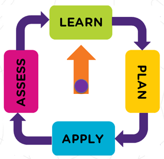

# Certificates from Online Courses
Certificates from my journey of continuous online learning.

I am using:
* LinkedIn Learning https://www.linkedin.com/learning/ ,
* Pluralsight https://www.pluralsight.com/, 
* Udemy https://www.udemy.com/, 
* Coursera https://www.coursera.org/ ,
* Alison https://alison.com/ ,
* Eduonix https://www.eduonix.com/
* Educative https://www.educative.io/

This is the manner I use to  improve my skills and gain the new ones I deem useful.

## Quote ##
“We now accept the fact that learning is a lifelong process of keeping abreast of change. And the most pressing task is to teach people how to learn.” -  Peter Drucker

