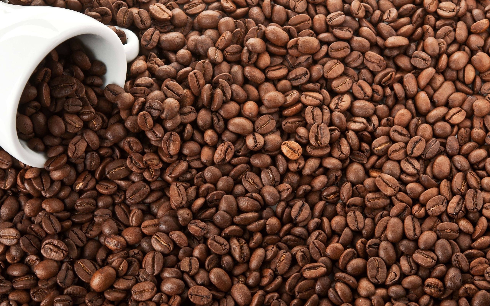

# Learning log

## Timeline and my focus
### 2014 - 2016 
* Microsoft Excel,
* Visual Basic for Applications,
* SQL,
* Dashboards,
* Business Intelligence,
* Reporting
### 2016 -2018  
* SQL Server,
* SQL Server Management Studio (SSMS),
* T-SQL,
* SQL Server Reporting Services (SSRS)
### 2018 -2020  
* Agile framework,
* Visual Studio IDE,
* C#,
* ASP.NET Web Forms,
* Javascript, jQuery
* CSS,
* HTML,
* Windows Presentation Foundation (WPF),
* XAML,
* Windows Forms
### 2020 - 2024 
* Agile Framework,
* Linux,
* Embedded Linux Development,
* Bare-metal development,
* Yocto Project,
* C,
* C++,
* Qt,
* STM32Cube IDE,
* STM32Cube MX,
* Lightweight and Versatile Embedded Graphics Library (LVGL),
* RTOS/FreeRTOS,
* Docker, GitLab, CI/CD,
* Python
### 2024 - 2025
* SAP S/4HANA
* ABAP
* SAP Business Technology Platform
* C#

## Courses Content
### Artificial Intelligence
* Artificial Intelligence Essentials Chatbots.pdf
* Artificial Intelligence Essentials Responsible AI.pdf
* Artificial Intelligence Foundations Thinking Machines.pdf
* Big Data in the Age of AI.pdf
* ChatGPT and ITCertifications.pdf
* Getting Started on Prompt Engineering.pdf
* Pair Programming with AI.pdf
* RPA AI and Cognitive Tech for Leaders NASBA.pdf
* The IT Ops Sessions GitHub Copilot for the IT Operations Professional.pdf

### Learning the C language
* C Data Structures Pointers and File Systems.pdf
* C Essential Training  2 Flow Control Arrays and Exception Handling.pdf
* C Essential Training 1 Syntax and Object Oriented Programming.pdf
* C Essential Training 1 The Basics 2018.pdf
* C Programming Language Fundamentals_PL.pdf
* C Programming Master the C Language.pdf
* Learn-Socket-Programming-Tutorial-in-C-from-Scratch.jpg
* Learning C.pdf
* Linux-Inter-Process-Communication-from-Scratch-in-C.pdf

### Learning the C# language
* ASP.NET Essential Training 2013.pdf
*  Beginning C# Collections_PL.pdf
* C Interfaces and Generics.pdf
* C# Fundamentals_PL.pdf
* CSharp 12 - Ultimate Guide - Beginner to Advanced  Master class.pdf (2025)
* CSharp Interfaces_PL.pdf
* Diploma_in_C_Programming_Alison_com_Bob_Tabor.pdf
* LINQ with C Essential Training.pdf
* Microsoft XAML 1 Core Concepts.pdf
* Microsoft XAML 2 Content and Properties.pdf
* Microsoft XAML 3 Type Converters and Resources.pdf
* Object-Oriented Programming Fundamentals in C#_PL.pdf
* Visual Studio Essential Training 01 Exploring the Visual Studio Ecosystem.pdf
* Visual Studio Essential Training 02 Getting Comfortable with the IDE.pdf
* Visual Studio Essential Training 03 Exploring Projects and Solutions.pdf
* Visual Studio Essential Training 05 Code Editors.pdf
* Visual Studio Essential Training 11 Data Tools.pdf
* Windows Presentation Foundation 1 Build Dramatic Desktop Applications.pdf
* Working with Nulls in C#_PL.pdf
* Xamarin.Forms The Big Picture_PL.pdf

### Learning the C++ language and the Qt framework
* Eduonix_certificate_learn-by-example-cplusplus-programming-75-solved-problems.jpg
* Eduonix_certificate_learn-by-example-cplusplus-programming-75-solved-problems.pdf
* Qt 5 C++ GUI Development For Beginners  The Fundamentals.pdf
* Qt 5 Core for Beginners with Cpp.pdf
* Qt 5 Widgets for Beginners with C++.pdf

## Online learning platforms:
* LinkedIn Learning https://www.linkedin.com/learning/ ,
* Pluralsight https://www.pluralsight.com/, 
* Udemy https://www.udemy.com/, 
* Coursera https://www.coursera.org/ ,
* Alison https://alison.com/ ,
* Eduonix https://www.eduonix.com/ ,
* Educative https://www.educative.io/ ,
* Michael Management https://www.michaelmanagement.com/ .
### How it goes

# About me
* George Calin
* george.calin [at] gmail.com
* LinkedIn: https://www.linkedin.com/in/cgeorge1978/

